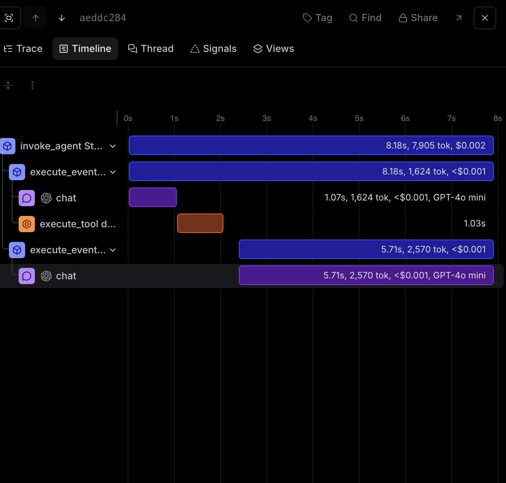

*Short explanation** (1-2 paragraphs) describing:
   - Which MCP server you connected to

   I am connected to Context7 MCP server https://mcp.context7.com/mcp.

   - What you observed in the Braintrust traces when MCP tools were called

   In Braintrust, I can see the tool name and the time the query took to excecute. For this specific query, only DuckDuckGo tool was used and no MCP tools were called. 
 

   - Brief comparison of MCP tool invocations vs DuckDuckGo tool invocations

   The MCP tool invocations would have been more specific to how it was set up as compared to the DuckDuckGo tool invocation was a more generci search. 
