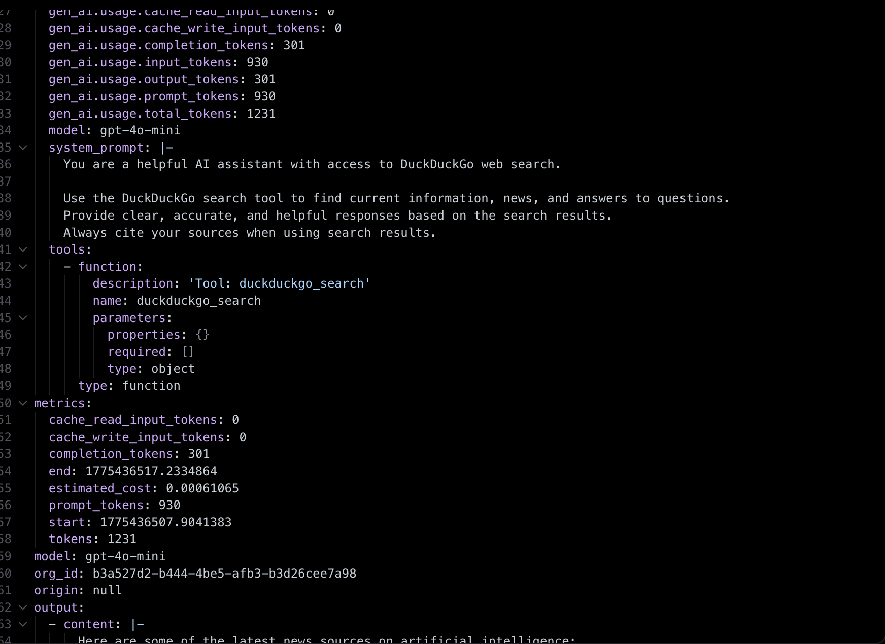
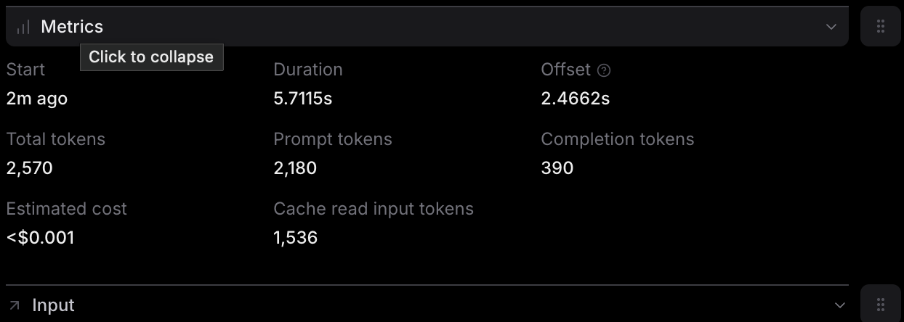
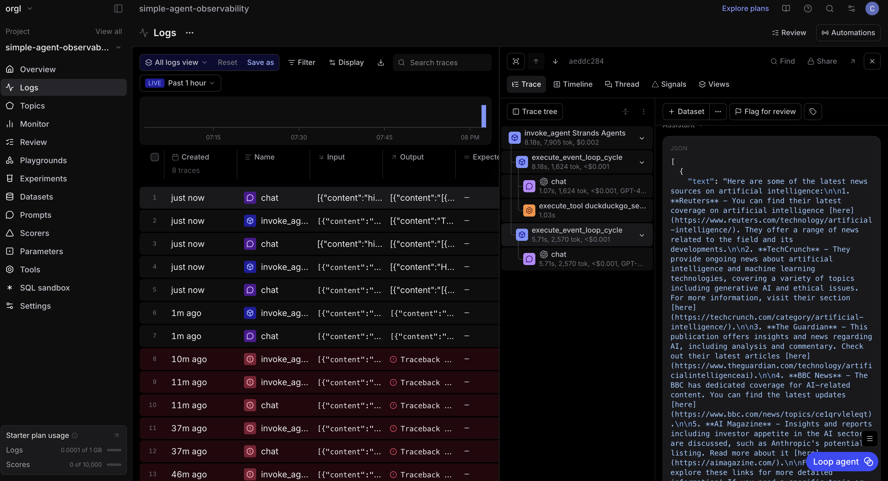

This is the full trace of one query which shows when the user sends the input and how the agent arrives to the answer.

This is the metrics of the one query 

This is an overall Braintrust dashboard. 

**What We're Looking For:**

Write **2-3 short paragraphs** describing your observations from the Braintrust dashboard, along with your screenshots. Your analysis should cover:

- What you see in the traces (hierarchy of operations, spans, tool calls)

From the BrainTrust trace, I can see that the user sends a query, the agent processes the input, the tool DuckDuckGo get called, and the final response gets returned. The tool called is DuckDuckGo in the span attached. 

- What metrics are captured and what patterns you notice

The metrics captured are the start time, the number of tokens,the estimated cost, the duration, the number of tokens for the prompt, the offset and the completion token. The patten that I noticed the completion tokens are smaller than the prompt token which may mean that the agent process more than it generates. The cost is very low. Knowing the amount of money that each query costs can help understand when the funds are being allocated. The agent takes longer to think but less time to generate a response.

- Any interesting observations about performance, token usage, or behavior differences across your queries

Throughout the queries, the agent consistently used more prompt tokens as compared to completion tokens. Overall, the agent did not take long to process the queries. 

Include your screenshots with brief captions explaining what they show.

This is an open-ended reflection on what you discover in the observability data - there's no single "right" answer. We want to see that you explored the dashboard and understood what the traces and metrics are telling you.
